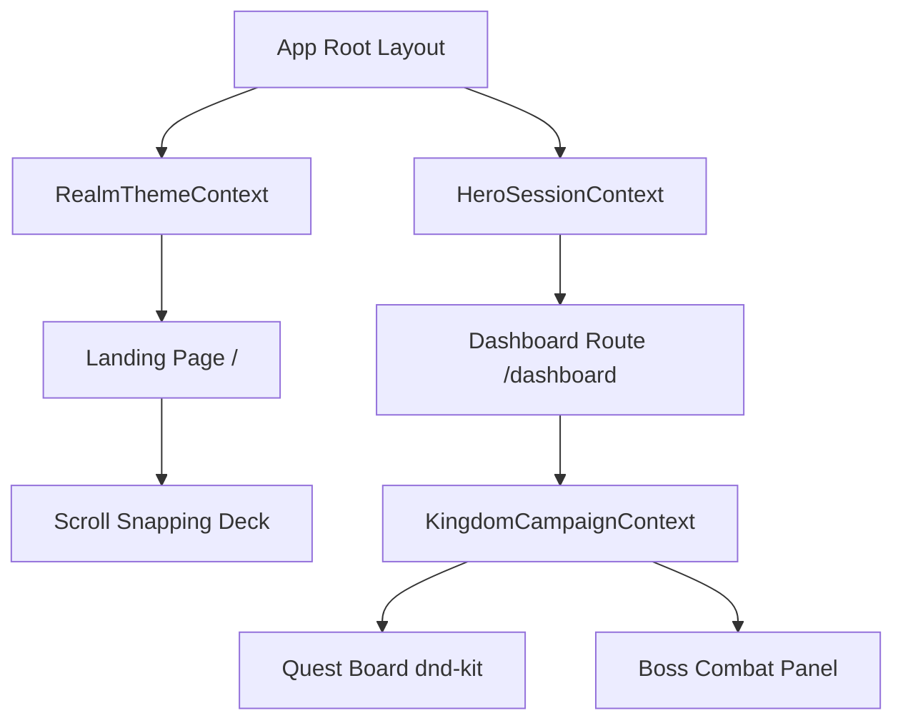

# Castellary MVP — Project Architecture

This document describes the overall architecture of **Castellary**, explaining the design pattern, components layer, context data flows, theme systems, and routing structure.

---

## 🏛️ Overall Architecture Design

Castellary follows a **Single Page Application (SPA) Cinematic Presentation** pattern for the landing experience, which transitions seamlessly into a **Context-Driven RPG Dashboard** layout once the user registers/logs in.

---

## 📁 Folder Structure Reference

* **`app/`**: Next.js app routes, layout configuration, and stylesheet injections.
* **`components/`**: Modular UI components.
  - **`components/landing/`**: Slide components, navigation overlays, and class portal gates.
  - **`components/dashboard/`**: Columns, cards, chronicles timeline, and boss widget frames.
  - **`components/ui/`**: Base widgets (buttons, progress bars, layout panels).
* **`context/`**: State providers for theme variables, sessions, drag states, and campaign tasks.
* **`hooks/`**: Custom logic hook functions (sounds, cursor motion, configuration fetches).
* **`lib/`**: Helpers, default mock database seed parameters, and motion transition settings.
* **`services/`**: Integration layers for API modules (Gemini, Supabase, browser notifications).
* **`types/`**: Interfaces and definitions.
* **`public/`**: Public static assets (themed images, background audio tracks, layout frames).

---

## 🎭 Animation & Transition System

1. **PowerPoint Easing:** Built using Framer Motion with custom cubic bezier settings (`cubic-bezier(0.16, 1, 0.3, 1)`) and `will-change` properties for 60fps GPU acceleration.
2. **Drift Particle Overlays:** Dynamic particle sweeps mapped to active civilization themes (e.g. fire embers for medieval, code pixels for cyberpunk, sakura petals for samurai).
3. **Entrance Staggers:** Content items rise slightly (`y: 15` or `y: 30`) while fading in to build layers sequentially.

---

## 🎨 Theme & Variable Inheritance

Theme inheritance flows downwards from `RealmThemeContext` via CSS variables:
* Colors map to variables like `--color-keep-primary`, `--color-keep-glass`, and `--color-keep-border`.
* Display fonts map to `--font-keep-display` (e.g. `Cinzel` for medieval, `Orbitron` for cyberpunk).
* Once the theme changes in the settings panel or slide snap, the CSS variables are updated on the DOM root, causing the entire layout (including the dashboard widgets, sidebar, topbar, and inputs) to instantly skin themselves without a page reload.
